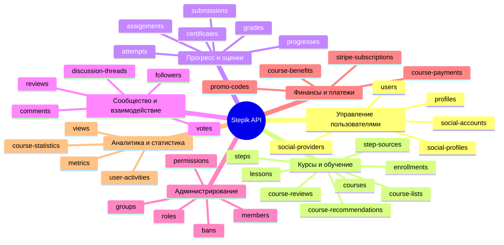

Справочные материалы по API платформы Stepik.

### 1. Документация и справочные материалы

* **`[https://stepik.org/api/docs](https://stepik.org/api/docs)`** — официальная интерактивная Swagger/OpenAPI документация, развернутая прямо на платформе. Позволяет просматривать схемы данных и тестировать `GET`-запросы в реальном времени.
* **`[https://github.com/StepicOrg/Stepik-API](https://github.com/StepicOrg/Stepik-API)`** — официальный GitHub-репозиторий от команды Stepik с техническим описанием архитектуры API, примерами скриптов (на Python и других языках) и разбором авторизационных сценариев.
* **`[https://help.stepik.org/article/64188](https://help.stepik.org/article/64188)`** — статья в Справочном центре Stepik, кратко описывающая базовые принципы работы, генерацию ключей и форматы запросов.

### 2. Авторизация и управление доступом (OAuth 2.0)

* **`[https://stepik.org/oauth2/applications/](https://stepik.org/oauth2/applications/)`** — панель управления вашими API-приложениями (доступна после авторизации на сайте). Здесь создаются связки `Client ID` и `Client Secret`, настраиваются `redirect_uri` и тип приложения.
* **`[https://stepik.org/oauth2/authorize/](https://stepik.org/oauth2/authorize/)`** — эндпоинт для перенаправления пользователя с целью получения кода авторизации (`Authorization Code Grant`).
* **`[https://stepik.org/oauth2/token/](https://stepik.org/oauth2/token/)`** — эндпоинт для обмена кода (`code`) или учетных данных на `access_token` и `refresh_token`, а также для последующего обновления токенов.

### 3. Базовый URL и ключевые эндпоинты (Плоская схема API)

Базовый URL для всех запросов к сущностям: **`https://stepik.org/api/`**

У Stepik «плоская» схема API (нет вложенных путей вида `/courses/1/lessons/2`), поэтому запросы всегда идут к корню сущности с фильтрацией через query-параметры:

**Используемые эндпоинты (нашим приложением):**

| Эндпоинт | Метод | Назначение |
|---|---|---|
| `/api/courses?teacher=` | GET | Курсы автора |
| `/api/course-grades?course=` | GET | Оценки студентов |
| `/api/certificates?course=` | GET | Сертификаты студентов |
| `/api/submissions?step=` | GET | Отправки решений (по шагам, все студенты) |
| `/api/course-benefit-by-months` | GET | Финансовые данные по месяцам |
| `/api/course-benefits` | GET | Детали по курсам |
| `/api/profiles` | GET | Профиль автора |
| `/api/users` | GET | Данные пользователя |
| `/api/course-review-summaries?ids[]=` | GET | Рейтинги и отзывы (side-loading по ID из `courses.review_summary`) |
| `/api/comments?course=` | GET | Комментарии студентов (20 на страницу, `page_size` игнорируется). `thread="solutions"` = опубликованные решения |
| `/api/course-reviews?course=` | GET | Тексты отзывов (score, text, reply_text, translations) |
| `/api/attempts?ids[]=` | GET | Пакетная загрузка попыток (batch до 300 IDs). Используется для получения `user_id` для submissions |

**Доступные эндпоинты Stepik API (полный каталог):**

* `/api/courses/` — курсы
* `/api/sections/` — разделы (модули) курсов
* `/api/units/` — связи между уроками и разделами
* `/api/lessons/` — уроки
* `/api/steps/` — шаги внутри уроков
* `/api/course-grades/` — оценки студентов
* `/api/enrollments/` — зачисления на курсы
* `/api/user-courses/` — курсы пользователя
* `/api/attempts/` — попытки решения
* `/api/submissions/` — отправленные ответы
* `/api/announcements/` — рассылки
* `/api/comments/` — комментарии


На основе предоставленной документации Stepik REST API я подготовил техническое описание всех доступных команд. Поскольку API содержит более 100 конечных точек, я организовал их в виде структурированного каталога с кратким описанием каждой команды.

## 📊 Обзор Stepik REST API

Stepik REST API предоставляет доступ к образовательной платформе Stepik, позволяя управлять курсами, пользователями, заданиями, прогрессом и другими объектами системы. API следует принципам REST и использует стандартные HTTP-методы (GET, POST, PUT, DELETE) для выполнения операций 【turn0fetch0】.

### 🔧 Основные характеристики API

| Характеристика | Значение |
|----------------|----------|
| **Базовый URL** | `https://stepik.org/api` |
| **Формат данных** | JSON |
| **Аутентификация** | Bearer token (требуется для большинства операций) |
| **Версионирование** | Неявное (через заголовки или параметры) |
| **Документация** | Swagger/OpenAPI спецификация |

## 📋 Полный каталог команд API

Ниже представлена таблица всех доступных команд API с их кратким описанием. Полное техническое описание каждой команды включает доступные методы, параметры и возвращаемые данные.



### 📖 Детальное описание команд по категориям

#### 👤 Пользователи и профили

| Команда | Описание | Основные операции |
|---------|----------|-------------------|
| **profiles** | Управление профилями пользователей | GET, POST, PUT, DELETE |
| **users** | Управление учетными записями пользователей | GET, POST, PUT, DELETE |
| **social-accounts** | Привязка социальных аккаунтов к пользователям | GET, POST, PUT, DELETE |
| **social-profiles** | Управление профилями в социальных сетях | GET, POST, PUT, DELETE |
| **social-providers** | Управление провайдерами социальной аутентификации | GET, POST, PUT, DELETE |
| **profile-images** | Загрузка и управление изображениями профилей | GET, POST, PUT, DELETE |

<details>
<summary>🔍 Пример технического описания команды (profiles)</summary>

**Команда**: `profiles`  
**Путь**: `/api/profiles`  
**Методы**:
- `GET /api/profiles` - Получение списка профилей
  - Параметры: `page`, `page_size`, `order`, `user`
  - Ответ: `200 OK` с массивом объектов профиля
- `POST /api/profiles` - Создание нового профиля
  - Тело запроса: объект профиля (first_name, last_name, bio и т.д.)
  - Ответ: `201 Created` с созданным объектом
- `GET /api/profiles/{id}` - Получение конкретного профиля
- `PUT /api/profiles/{id}` - Обновление профиля
- `DELETE /api/profiles/{id}` - Удаление профиля

**Структура данных профиля**:
```json
{
  "id": 123,
  "user": 456,
  "first_name": "Иван",
  "last_name": "Иванов",
  "bio": "Описание профиля",
  "avatar": "url_to_image",
  "city": 789,
  "country": "RU",
  "created_at": "2023-01-01T00:00:00Z",
  "updated_at": "2023-01-02T00:00:00Z"
}
```
</details>

#### 🎓 Курсы и образовательный контент

| Команда | Описание | Основные операции |
|---------|----------|-------------------|
| **courses** | Управление курсами | GET, POST, PUT, DELETE |
| **course-lists** | Списки курсов (подборки) | GET, POST, PUT, DELETE |
| **course-reviews** | Отзывы на курсы | GET, POST, PUT, DELETE |
| **course-recommendations** | Рекомендации курсов пользователям | GET, POST, PUT, DELETE |
| **lessons** | Управление уроками | GET, POST, PUT, DELETE |
| **steps** | Управление шагами в уроках | GET, POST, PUT, DELETE |
| **step-sources** | Исходный код шагов | GET, POST, PUT, DELETE |
| **step-votes** | Голосование за шаги | GET, POST, PUT, DELETE |
| **sections** | Управление разделами курсов | GET, POST, PUT, DELETE |
| **units** | Управление модулями курсов | GET, POST, PUT, DELETE |

<details>
<summary>🔍 Пример технического описания команды (courses)</summary>

**Команда**: `courses`  
**Путь**: `/api/courses`  
**Методы**:
- `GET /api/courses` - Получение списка курсов
  - Параметры: `page`, `page_size`, `order`, `tag`, `language`, `is_public`
  - Ответ: `200 OK` с массивом объектов курса
- `POST /api/courses` - Создание нового курса
  - Тело запроса: объект курса (title, summary, language, is_public и т.д.)
  - Ответ: `201 Created` с созданным объектом
- `GET /api/courses/{id}` - Получение конкретного курса
- `PUT /api/courses/{id}` - Обновление курса
- `DELETE /api/courses/{id}` - Удаление курса

**Структура данных курса**:
```json
{
  "id": 123,
  "title": "Введение в программирование",
  "summary": "Базовый курс по основам программирования",
  "language": "ru",
  "is_public": true,
  "is_featured": false,
  "tag": "programming",
  "author": 456,
  "created_at": "2023-01-01T00:00:00Z",
  "updated_at": "2023-01-02T00:00:00Z",
  "cover_image": "url_to_cover",
  "students_count": 1000,
  "review_summary": {
    "average": 4.5,
    "count": 100
  }
}
```
</details>

#### 📊 Прогресс и оценки

| Команда | Описание | Основные операции |
|---------|----------|-------------------|
| **progresses** | Прогресс пользователей по курсам | GET, POST, PUT, DELETE |
| **submissions** | Решения пользователей по заданиям | GET, POST, PUT, DELETE |
| **attempts** | Попытки решения заданий | GET, POST, PUT, DELETE |
| **assignments** | Назначения заданий пользователям | GET, POST, PUT, DELETE |
| **course-grades** | Оценки по курсам | GET, POST, PUT, DELETE |
| **certificates** | Сертификаты об окончании курсов | GET, POST, PUT, DELETE |
| **course-progress-changes** | История изменений прогресса по курсам | GET, POST, PUT, DELETE |

<details>
<summary>🔍 Пример технического описания команды (submissions)</summary>

**Команда**: `submissions`  
**Путь**: `/api/submissions`  
**Методы**:
- `GET /api/submissions` - Получение списка решений
  - Параметры: `page`, `page_size`, `order`, `user`, `step`, `attempt`
  - Ответ: `200 OK` с массивом объектов решения
- `POST /api/submissions` - Создание нового решения
  - Тело запроса: объект решения (reply, attempt, step и т.д.)
  - Ответ: `201 Created` с созданным объектом
- `GET /api/submissions/{id}` - Получение конкретного решения
- `PUT /api/submissions/{id}` - Обновление решения
- `DELETE /api/submissions/{id}` - Удаление решения

**Структура данных решения**:
```json
{
  "id": 123,
  "step": 456,
  "attempt": 789,
  "user": 101,
  "reply": {
    "choices": [1, 3, 2],
    "text": "Ответ пользователя"
  },
  "status": "correct",
  "score": 10,
  "feedback": {
    "is_correct": true,
    "message": "Отличная работа!"
  },
  "created_at": "2023-01-01T00:00:00Z",
  "updated_at": "2023-01-01T00:05:00Z"
}
```
</details>

#### 💬 Сообщество и взаимодействие

| Команда | Описание | Основные операции |
|---------|----------|-------------------|
| **comments** | Управление комментариями | GET, POST, PUT, DELETE |
| **discussion-threads** | Темы обсуждений | GET, POST, PUT, DELETE |
| **discussion-proxies** | Прокси для обсуждений | GET, POST, PUT, DELETE |
| **followers** | Подписчики пользователей | GET, POST, PUT, DELETE |
| **votes** | Голосование за контент | GET, POST, PUT, DELETE |
| **reviews** | Отзывы на курсы | GET, POST, PUT, DELETE |
| **review-sessions** | Сессии рецензирования | GET, POST, PUT, DELETE |

#### 🛠 Администрирование и настройки

| Команда | Описание | Основные операции |
|---------|----------|-------------------|
| **bans** | Баны пользователей | GET, POST, PUT, DELETE |
| **members** | Члены групп и организаций | GET, POST, PUT, DELETE |
| **groups** | Управление группами | GET, POST, PUT, DELETE |
| **roles** | Роли пользователей | GET, POST, PUT, DELETE |
| **permissions** | Разрешения для ролей | GET, POST, PUT, DELETE |
| **invitations** | Приглашения в группы | GET, POST, PUT, DELETE |
| **instructions** | Инструкции для пользователей | GET, POST, PUT, DELETE |

#### 💰 Финансы и платежи

| Команда | Описание | Основные операции |
|---------|----------|-------------------|
| **course-payments** | Платежи за курсы | GET, POST, PUT, DELETE |
| **course-benefits** | Выгоды от курсов | GET, POST, PUT, DELETE |
| **course-beneficiaries** | Получатели выгод | GET, POST, PUT, DELETE |
| **course-beneficiary-revenues** | Доходы получателей | GET, POST, PUT, DELETE |
| **course-beneficiary-transfers** | Переводы получателям | GET, POST, PUT, DELETE |
| **course-benefit-by-months** | Выгоды по месяцам | GET, POST, PUT, DELETE |
| **course-benefit-summaries** | Сводки по выгодам | GET, POST, PUT, DELETE |
| **stripe-subscriptions** | Подписки Stripe | GET, POST, PUT, DELETE |
| **stripe-coupons** | Купоны Stripe | GET, POST, PUT, DELETE |
| **stripe-plans** | Планы Stripe | GET, POST, PUT, DELETE |
| **promo-codes** | Промокоды | GET, POST, PUT, DELETE |

#### 📈 Аналитика и статистика

| Команда | Описание | Основные операции |
|---------|----------|-------------------|
| **course-statistics** | Статистика по курсам | GET, POST, PUT, DELETE |
| **course-by-language-statistics** | Статистика по языкам | GET, POST, PUT, DELETE |
| **course-period-statistics** | Статистика за период | GET, POST, PUT, DELETE |
| **course-total-statistics** | Общая статистика курса | GET, POST, PUT, DELETE |
| **user-activities** | Активность пользователей | GET, POST, PUT, DELETE |
| **user-activity-summaries** | Сводки активности | GET, POST, PUT, DELETE |
| **metrics** | Метрики системы | GET, POST, PUT, DELETE |
| **views** | Просмотры контента | GET, POST, PUT, DELETE |
| **visited-courses** | Посещенные курсы | GET, POST, PUT, DELETE |

#### 📚 Дополнительные команды

| Команда | Описание | Основные операции |
|---------|----------|-------------------|
| **achievements** | Достижения пользователей | GET, POST, PUT, DELETE |
| **achievement-progresses** | Прогресс достижений | GET, POST, PUT, DELETE |
| **announcements** | Объявления | GET, POST, PUT, DELETE |
| **attachments** | Вложения | GET, POST, PUT, DELETE |
| **author-lists** | Списки авторов | GET, POST, PUT, DELETE |
| **catalog-blocks** | Блоки каталога | GET, POST, PUT, DELETE |
| **cities** | Города | GET, POST, PUT, DELETE |
| **countries** | Страны | GET, POST, PUT, DELETE |
| **devices** | Устройства пользователей | GET, POST, PUT, DELETE |
| **email-addresses** | Email-адреса | GET, POST, PUT, DELETE |
| **email-templates** | Шаблоны писем | GET, POST, PUT, DELETE |
| **exam-sessions** | Сессии экзаменов | GET, POST, PUT, DELETE |
| **features** | Функции платформы | GET, POST, PUT, DELETE |
| **magic-links** | Магические ссылки | GET, POST, PUT, DELETE |
| **meta-categories** | Мета-категории | GET, POST, PUT, DELETE |
| **mobile-tiers** | Уровни для мобильных устройств | GET, POST, PUT, DELETE |
| **notification-statuses** | Статусы уведомлений | GET, POST, PUT, DELETE |
| **notifications** | Уведомления | GET, POST, PUT, DELETE |
| **paid-features** | Платные функции | GET, POST, PUT, DELETE |
| **platform-news** | Новости платформы | GET, POST, PUT, DELETE |
| **proctor-sessions** | Сессии прокторинга | GET, POST, PUT, DELETE |
| **promo-block-placements** | Размещения промо-блоков | GET, POST, PUT, DELETE |
| **promo-blocks** | Промо-блоки | GET, POST, PUT, DELETE |
| **queries** | Запросы | GET, POST, PUT, DELETE |
| **random-exams** | Случайные экзамены | GET, POST, PUT, DELETE |
| **recommendation-reactions** | Реакции на рекомендации | GET, POST, PUT, DELETE |
| **recommendations** | Рекомендации | GET, POST, PUT, DELETE |
| **regions** | Регионы | GET, POST, PUT, DELETE |
| **reminders** | Напоминания | GET, POST, PUT, DELETE |
| **rubric-scores** | Оценки по рубрикам | GET, POST, PUT, DELETE |
| **rubrics** | Рубрики | GET, POST, PUT, DELETE |
| **sale-course-applications** | Заявки на продажу курсов | GET, POST, PUT, DELETE |
| **score-files** | Файлы с оценками | GET, POST, PUT, DELETE |
| **scripts** | Скрипты | GET, POST, PUT, DELETE |
| **search-reactions** | Реакции на поиск | GET, POST, PUT, DELETE |
| **search-results** | Результаты поиска | GET, POST, PUT, DELETE |
| **service-requests** | Запросы в службу поддержки | GET, POST, PUT, DELETE |
| **specializations** | Специализации | GET, POST, PUT, DELETE |
| **step-issues** | Проблемы с шагами | GET, POST, PUT, DELETE |
| **step-snapshots** | Снимки шагов | GET, POST, PUT, DELETE |
| **stepics** | Элементы шагов | GET, POST, PUT, DELETE |
| **storage-records** | Записи хранилища | GET, POST, PUT, DELETE |
| **story-templates** | Шаблоны историй | GET, POST, PUT, DELETE |
| **students** | Студенты | GET, POST, PUT, DELETE |
| **subjects** | Предметы | GET, POST, PUT, DELETE |
| **subscriptions** | Подписки | GET, POST, PUT, DELETE |
| **tags** | Теги | GET, POST, PUT, DELETE |
| **times** | Время | GET, POST, PUT, DELETE |
| **todo-items** | Элементы списка дел | GET, POST, PUT, DELETE |
| **user-code-runs** | Запуски пользовательского кода | GET, POST, PUT, DELETE |
| **user-courses** | Курсы пользователя | GET, POST, PUT, DELETE |
| **user-financial-details** | Финансовые детали пользователя | GET, POST, PUT, DELETE |
| **user-lessons** | Уроки пользователя | GET, POST, PUT, DELETE |
| **user-review-summaries** | Сводки отзывов пользователя | GET, POST, PUT, DELETE |
| **videos** | Видео | GET, POST, PUT, DELETE |
| **wish-lists** | Списки желаний | GET, POST, PUT, DELETE |
| **ws** | WebSocket соединения | GET, POST, PUT, DELETE |

## 🚀 Рекомендации по работе с API

### 1. **Аутентификация**
Большинство запросов требуют Bearer token:
```bash
curl -H "Authorization: Bearer YOUR_TOKEN" https://stepik.org/api/courses
```

### 2. **Пагинация**
Все списковые запросы поддерживают пагинацию:
- `page` - номер страницы (по умолчанию 1)
- `page_size` - количество элементов на странице (по умолчанию 20, максимум 100)

> **⚠️ ВАЖНО: `page_size` реально игнорируется многими эндпоинтами.** `/course-grades`, `/submissions?step=` и другие эндпоинты всегда возвращают **20 записей** на страницу, неважно что передано в `page_size`. Не рассчитывай на 500/1000 записей в одной странице.

> **⚠️ `has_next` может возвращать `true` на страницах за пределами данных.** Обязательно ставь лимит `max_pages` (рекомендуется 500) чтобы избежать бесконечной пагинации. Наша функция `_paginated_get` принимает параметр `max_pages=500` и `on_page` callback для прогресса.

### 2.1. **Критические особенности эндпоинтов**

| Эндпоинт | Особенность |
|---|---|
| `/course-grades?course=X` | Возвращает **только 20 записей** на страницу (page_size игнорируется). `has_next=true` даже за пределами данных. ~350 страниц на курс с 7k студентов. |
| `/submissions?course=X` | Возвращает **только submissions текущего автора**, а не всех студентов. Для всех студентов используй `GET /submissions?step=STEP_ID`. |
| `/submissions?step=X` | Возвращает **все** submissions по шагу (все студенты). Поле `user` всегда `None` — это норма, API не отдаёт user ID в ответе. Поддерживает фильтр `order` (asc/desc). `has_next=true` может быть всегда true. Лимит `max_pages` обязателен. |
| `/comments?course=X` | Максимум 20 комментариев на страницу (page_size > 20 игнорируется). Пагинация через `page`. |

### 3. **Фильтрация и сортировка**
- `order` - сортировка (например, `-created_at` для убывания даты создания)
- Различные параметры фильтрации в зависимости от команды

### 4. **Ограничения по скорости**
API имеет ограничения по количеству запросов в единицу времени. Рекомендуется использовать кэширование и оптимизировать запросы.

### 5. **Версионирование**
Рекомендуется явно указывать версию API в заголовках:
```bash
-H "Accept: application/vnd.stepik.v2+json"
```

## 📝 Заключение

Stepik REST API предоставляет comprehensive доступ ко всем функциям образовательной платформы. Для получения детальной информации о конкретной команде рекомендуется:

1. Перейти к [официальной документации](https://stepik.org/api/docs)
2. Выбрать интересующую команду в списке
3. Нажать "Expand Operations" для просмотра всех доступных методов
4. Использовать "Raw" для получения спецификации в формате JSON

## 🔍 Исследованные эндпоинты (поля и примеры)

### `/api/profiles` — Профили пользователей

**Поля:** `id`, `first_name`, `last_name`, `full_name`, `avatar` (URL), `short_bio`, `city`, `language`, `is_staff`, `is_creator`, `is_email_verified`

**Запрос:** `GET /profiles?ids[]=123&ids[]=456` — пакетный, до 30 ID за раз

**Пример ответа:**
```json
{
  "id": 64381531,
  "first_name": "Вячеслав",
  "last_name": "Колосков",
  "full_name": "Вячеслав Колосков",
  "avatar": "https://cdn.stepik.net/media/users/64381531/avatar.png",
  "short_bio": "Machine Learning Engineer",
  "is_creator": true
}
```

**Лимит:** Нет пагинации — работает через `ids[]`. 10k студентов = 334 запроса. Стоит использовать **ленивую загрузку** (по запросу при открытии профиля) или только для активных студентов.

---

### `/api/course-reviews` — Тексты отзывов

**Поля:** `id`, `course`, `user`, `score` (1-5), `text`, `reply_text` (ответ автора), `create_date`, `update_date`, `translations.text.ru`, `epic_count`, `abuse_count`, `vote_delta`

**Запрос:** `GET /course-reviews?course=58852&page_size=20` — пагинация по 20

**Пример ответа:**
```json
{
  "id": 542390,
  "course": 58852,
  "user": 1238806640,
  "score": 1,
  "text": "very difficcult",
  "reply_text": "",
  "create_date": "2026-07-26T12:46:58.798Z",
  "translations": {"text": {"ru": "очень трудный"}}
}
```

**Вердикт:** Данные лёгкие, мало отзывов (десятки, не тысячи). Открывает карточку «Отзывы» с реальными текстами. Можно показывать текст + ответ автора + дату.

---

### `/api/comments` — Комментарии и опубликованные решения

**Поля:** `id`, `course`, `user`, `thread` ("solutions" | "default"), `submission` (ID решения, если thread="solutions"), `text`, `time`, `update_date`, `is_deleted`, `is_approved`, `parent`

**Запрос:** `GET /comments?course=58852&page=1&page_size=20` — пагинация по 20 (page_size > 20 игнорируется)

**Пример ответа:**
```json
{
  "id": 93847817,
  "course": 167495,
  "user": "64381531",
  "thread": "solutions",
  "submission": 65875961,
  "text": "```python\nprint('Hello')\n```",
  "time": "2026-07-19T13:28:45.640Z",
  "parent": null
}
```

**Важно:** Поле `thread` определяет тип комментария:
- `"solutions"` — опубликованное студентом решение (содержит `submission` ID)
- `"default"` — обычный комментарий

**Использование:** В `sync_community_stats` комментарии с `thread="solutions"` считаются отдельно как опубликованные решения (`solutions_monthly`, `total_solutions`) и отображаются на странице Активности.

---

### `/api/course-reviews` — Тексты отзывов

**Поля:** `id`, `course`, `user`, `score` (1-5), `text`, `reply_text` (ответ автора), `create_date`, `update_date`, `translations.text.ru`, `epic_count`, `abuse_count`, `vote_delta`

**Запрос:** `GET /course-reviews?course=58852&page_size=20` — пагинация по 20

**Пример ответа:**
```json
{
  "id": 542390,
  "course": 58852,
  "user": 1238806640,
  "score": 1,
  "text": "very difficcult",
  "reply_text": "",
  "create_date": "2026-07-26T12:46:58.798Z",
  "translations": {"text": {"ru": "очень трудный"}}
}
```

**Вердикт:** Данные лёгкие, мало отзывов (десятки, не тысячи). Открывает карточку «Отзывы» с реальными текстами. Можно показывать текст + ответ автора + дату.

---

### `/api/attempts` — Попытки решения

**Поля:** `id`, `step`, `user`, `time`, `status` (active), `dataset` (входные данные), `time_left`

**Вердикт:** Не нужно — `submissions` уже содержат статус, время, язык, оценку.

---

### `/api/progresses` — Прогресс по шагам

**Поля:** `id`, `user`, `target`, `score`, `cost`, `time`, `is_passed`, `step`

**Вердикт:** Не нужно — `course-grades` уже содержит агрегированный прогресс.

---

### `/api/announcements` — Рассылки

**Вердикт:** Пусто / недоступно через read-only API.

---

### `/api/course-total-statistics` и `/api/course-period-statistics`

**Вердикт:** Недоступно — требуют права автора/админа.